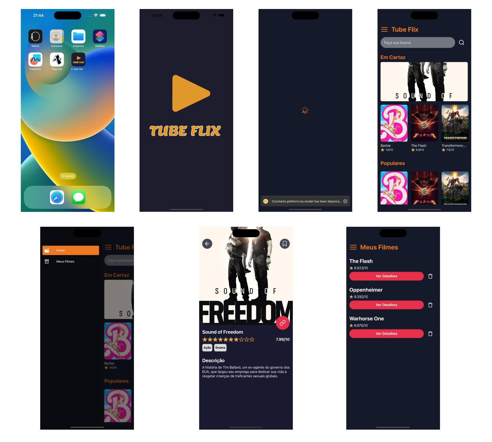

  

# :clipboard: Sobre o projeto

Este é um projeto simples onde você poderá ver um pouco mais sobre mim e meus conhecimentos em desenvolvimento mobile.
aplicativo que lista filmes e mostra detallhes de lançamento, sinopse e genero.

Abaixo podemos ver o resultado final do projeto. Espero que gostem!

<br>
<p align="center">
   
  </p>

# 🔗 Download do projeto no link abaixo.

- [Tube Flix](https://play.google.com/store/apps/details?id=com.willcode2019.tubflix)

- [Expo](https://docs.expo.dev/)
- [React-Native](https://reactnative.dev/)
- [Estyled-Components](https://styled-components.com/)


## 🌐 Para iniciarlizar o projeto utilize o comando abaixo:

```bash

#Clonando o repositório do Github:
$ git clone https://github.com/willtechcod/Tub-Flix.git

#Acessar pasta do projeto:
$ cd Tub-Flix

#Instalar pasta node_modules:
$ npm i

#Inicializar o projeto:
$ npx expo start

```


<p align="center">
  
  </p>
